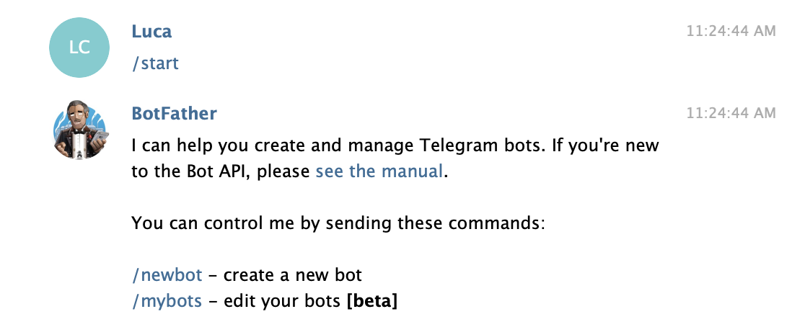
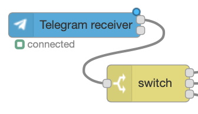
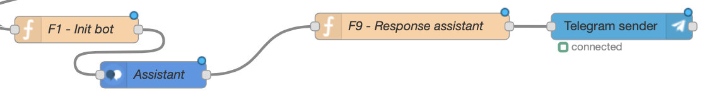
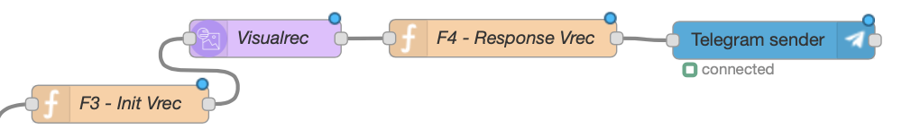
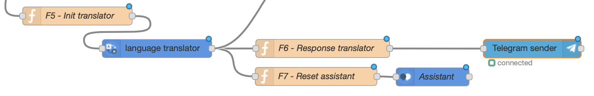
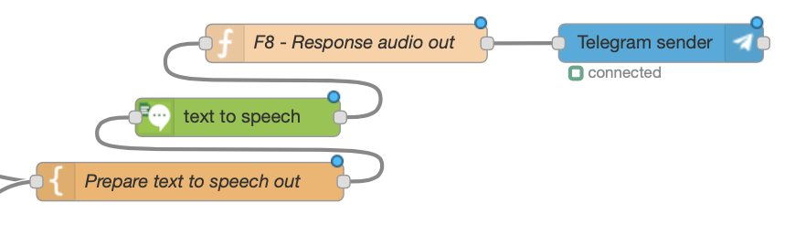
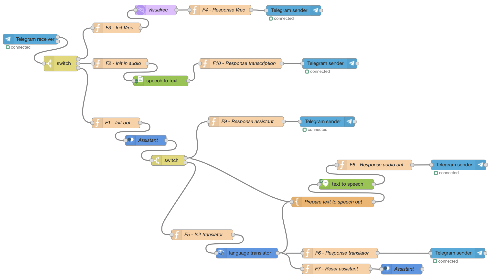
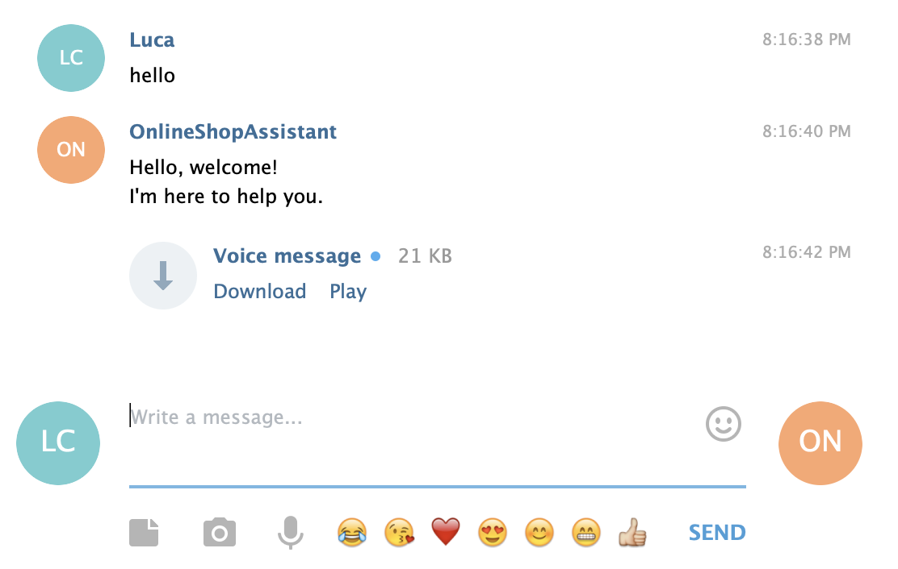
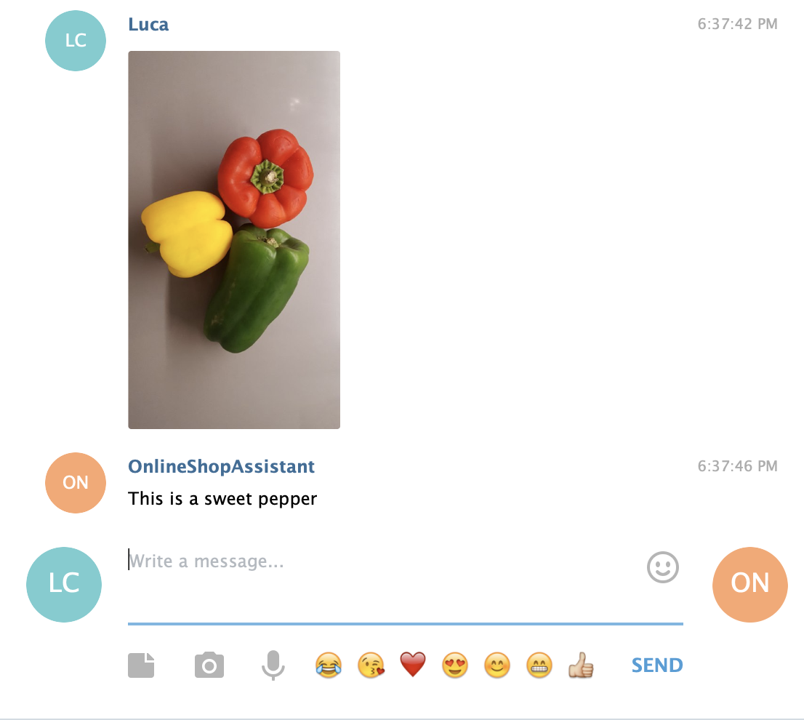

# Create a Telegram bot with Watson!

This tutorial will show how to integrate a Chatbot made with Watson into a Telegram bot built with Node-RED. No coding skills are needed!
This tutorial collects all experience gained on Watson Assistant and Node-RED during ASL 2017-2018 sessions.

## Features

The final bot will implement natural language chat, vocal message interactions, visual recognition on photos and sentences translation.

- Receive vocal messages - easy to use, easy to listen!
- Ask to translate sentences in many languages
- Ask for support on the selected topic (in this demo: online retail store assistance)
- Receive description of photos - you can use your own trained Watson Visual Recognition classifiers!

## Prerequisites

Prerequisites to get this tutorial done are:
1. An IBM Cloud account
2. Choose the option that fits:
  - Do you want to have a custom Virtual Assistant? -> Go to step 3
  - Do you just want to know how it works the Node-RED Watson Assistant integration, of do you already have a trained Virtual Assistant? -> Skip step 3 and go to step 4
3. Make sure you completed this tutorial to have a custom Virtual Assistant with Watson Assistant: https://github.com/lucacrippa88/watson-assistant-training
4. You are done with prerequisites!

## How to expect from this tutorial

This tutorial will show you how to create a simple web-based interface for your Virtual Assistant and alternatively a Telegram Bot connected to Watson Assistant. All other technical activities are based on the native Node-RED flow interface.

## Tutorial

### Basic Telegram Watson Assistant integration

Follow these steps to complete the tutorial.

#### Step 1 - Create a bot on Telegram
- Search \@BotFather on Telegram search bar, type /start and follow the instruction provided. Type /newbot and enter the name of the bot (it must end with "bot")
- Then, save the token string to use it later in Node-RED

#### Step 2 - Create a Node-RED application
- Select Node-RED Starter boilerplate on IBM Cloud catalog
- Enter needed data and click create
- You should protect your app with a username and password: you can do so by filling the form once the app is started

#### Step 3 - Install Telegram nodes on Node-RED
- Once you are in the main RED dashboard of your app, click in install tab and search for telegram
- Then install "node-red-contrib-telegrambot"

Note: if the Telegram nodes installation fails, please retry a couple of times.

#### Step 4 - Use Telegram nodes
- Add the "Telegram receiver" node
- Then, add the bot created by inserting the name and the token received from \@BotFather by clicking on the pencil icon
- Setup the switch node: first output should be set == "photo", second == "voice" (to be check), third to otherwise.

#### Step 5 - Watson Assistant integration
In order to integrate Watson Assistant in a Telegram bot, some nodes are required: "Telegram receiver", "function", "assistant", "function", "Telegram sender".

- Telegram receiver: already set-up
- Function 1: use code listed in js folder (https://github.com/lucacrippa88/watson-assistant-nodered/tree/master/js/function1.js)
- Assistant: add Username & Password of the service, then the Skill ID (Workspace ID)
- Function 9: use code listed in js folder (https://github.com/lucacrippa88/watson-assistant-nodered/tree/master/js/function9.js)
- Telegram sender: already set-up

### Advanced Telegram Watson Assistant integration

#### Step 6 - Adding Watson Visual Recognition
The Virtual Assistant linked below has been created to support users of a retail shop, both online and physical store. You can find here the trained assistant: https://github.com/lucacrippa88/watson-assistant-training/tree/master/online-shop-virtual-assistant

A customer could need to gather information on the product he's looking at. By introducing a Watson Visual Recognition integration, your Virtual Assistant can be able to send information about a product in a picture taken on the shop.

- Create a Visual Recognition service on IBM Cloud
- Optional: connect the Visual Recognition service to the main Node-RED application and restage it
- Add a switch as shown in picture to ensure that if content type is "photo" the program goes to Visual Recognition flow
- Function 3: use code listed in js folder (https://github.com/lucacrippa88/watson-assistant-nodered/tree/master/js/function3.js)
- Visual Recognition: insert API Key and ensure correct Endpoint URL of Visual Recognition service (provided by IBM Cloud)
- Function 4: use code listed in js folder (https://github.com/lucacrippa88/watson-assistant-nodered/tree/master/js/function4.js)

Now you can send a photo to your telegram bot and it will classify the image using Watson Visual Recognition using general classifiers.

Note that with IBM Watson you can easily train your own classifiers to ensure that the AI Visual Recognition feature will have the right knowledge on your custom problem. In example, do you have an enterprise that creates very particular design furniture? You can train your Visual Recognition classifiers on your design products in order to classify them, understand problems/issues during creation process, auto tag and so on!

#### Step 7 - Adding Watson Translator
Another useful feature to be integrated inside the Telegram bot is the language translation. An user can ask the bot to translate a sentence in real time leveraging on Watson Translator API.

Note: this step needs to train a Watson Assistant to understand translation scope. Please refer to this link to have it done (link to come!).

- Function 5: use code listed in js folder (https://github.com/lucacrippa88/watson-assistant-nodered/tree/master/js/function5.js)
- Language Translator: set the API Key of Language Translator service (provided by IBM Cloud)
- Function 6: use code listed in js folder (https://github.com/lucacrippa88/watson-assistant-nodered/tree/master/js/function6.js)
- Telegram sender: already setup (copy and paste the previous one)
- Function 7: use code listed in js folder (https://github.com/lucacrippa88/watson-assistant-nodered/tree/master/js/function7.js)
- Assistant: add Username & Password of the service, then the Skill ID (Workspace ID)

#### Step 8 - Adding Watson Text to Speech
An interesting feature that can be easily implemented is the Text to Speech service: this will send you output messages as audio messages, so you will be able to listen to your Assistant answers.

## Full flow

In the picture below there is the full flow with all modules.

Please note: the Speech to Text flow (with F2 and F10 functions) is still in development, so it is not described in this guide.

## Videos

Almost 5 videos are coming (Italian).

## Notes

Watson Assistant is being continuously updated. All info and code in these repos should be compatible with new versions of the APIs, even if some notation could change (e.g. "Workspaces" renamed "Skills").

## Outcomes

Outcome of conversation with audio message out.

Outcome of Visual Recognition feature. By now it only answers with the most probably recognition, but it's possible also to have the other options displayed.

## Disclaimer

This is not an official asset. It has been created by me and it's not intended for professional use. However, it follows all guidelines you can find in https://console.bluemix.net/docs/services/conversation/ and in https://www.ibm.com/watson/developercloud/assistant/api/v1/. For Watson Services SLAs, please have a look here: https://www-03.ibm.com/software/sla/sladb.nsf/sla/bm-0038-09. Video tutorial linked are not official assets.

## License

his project uses the Apache License Version 2.0 software license. https://github.com/lucacrippa88/watson-assistant-nodered/blob/master/LICENSE
